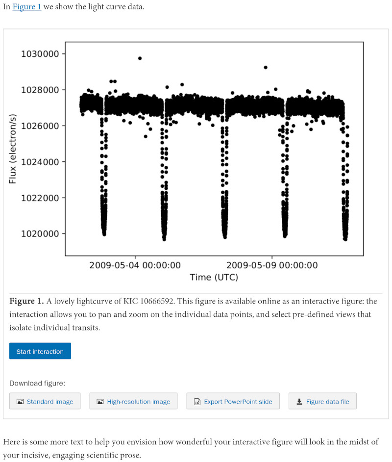

+++
date = 2019-09-23T11:54:40-04:00
title = "Creating Interactive Figures with the New AAS Timeseries Tool"
+++

Electronic publishing makes it possible to convey scientific content not just
with static images but with interactive, exploratory visualizations. This is a
big opportunity to improve the way we do science! So,
[the American Astronomical Society] (AAS, publisher of the
[Astrophysical Journal], the [Planetary Science Journal], and others) is
working to make it as easy as possible to include “interactive figures” in
your articles. This year AAS is launching new [Jupyter]-based tools to help you
create interactive figures for two common data types: timeseries and sky
images. With [our recent announcement of the aas-timeseries package], I
thought I’d write up the end-to-end workflow for making and submitting
interactive figures with these new tools.

[the American Astronomical Society]: https://aas.org/
[Astrophysical Journal]: https://iopscience.iop.org/journal/0004-637X
[Planetary Science Journal]: https://iopscience.iop.org/journal/2632-3338
[Jupyter]: https://jupyter.org/
[our recent announcement of the aas-timeseries package]: https://journals.aas.org/new-time-series-tool/

<!-- more -->

# What Are We Doing Here?

First, let’s step back a bit. What’s the big idea behind this project?

If you ask me, the big idea is communication: *readers should be presented
with a rich set of tools for exploring and understanding the data presented in
research articles*. Static plots and data tables are good, but electronic
publishing makes it possible to give readers much more sophisticated ways to
investigate the data in a publication. In one kind of ideal world, readers
would be able to simply click on the data in an article and immediately start
exploring them using their favorite analysis tools.

It sounds like it would be a lot of work for authors to wire up this kind of
complex functionality. But what if we invert this vision — *what if your
favorite analysis tools could be embedded inside your publications?* What if
your tool could save not only data files, but *itself*, along with all of your
data analysis setup — and someone else could trivially open it all up and
start working in exactly the same analysis environment you used to do your
research?

To achieve this vision would require some kind of universal platform for
authoring and distributing custom, interactive, graphics-intensive software.
Fortunately for astronomers, industry has poured billions of dollars into this
very problem and come up with a pervasive, extraordinarily successful
solution: the Web. If your data analysis tool is implemented in HTML and
JavaScript, it is easy to embed elsewhere — and it’s only the proverbial
[Small Matter of Programming] to be able to replicate its current internal
state along with its main application code.

[Small Matter of Programming]: https://en.wikipedia.org/wiki/Small_matter_of_programming

We run into a snag here since most scientific data analysis tools are not, in
fact, implemented in HTML and JavaScript. But that’s changing, almost entirely
thanks to the rise of the [Jupyter] ecosystem. While you might think of the
“notebook” user interface paradigm as the big innovation in Jupyter, I would
argue that more important is the fact that you interact with these notebooks
through your web browser. Graphical “widgets” in Jupyter notebooks must be
implemented in HTML, and this requirement is driving a development boom in
Web-based scientific data analysis tools like [vaex] or [vega].

[vaex]: https://vaex.io/
[vega]: https://vega.github.io/vega/

Finally we get back to the [AAS]. Our new [aas-timeseries] package aims to
embody this vision of *an embeddable data analysis tool* for the
particular domain of *timeseries* data, chosen because it’s quite common in
astronomy. It’s designed for the [Jupyter] environment for the reasons
described above. We hope that you’ll find it to be a delightful data analysis
tool — which just happens to provide you with a unique and powerful new way to
help communicate your insights to the readers of your publications.

[AAS]: https://aas.org/
[aas-timeseries]: https://aas-timeseries.readthedocs.io/

Without further ado, let’s work see how it all works in practice!


# Step 0: Requirements

The new tools are based on Python and [Jupyter] and we do assume here that
you’re familiar with them.

If that’s the case, we’ve made it so that you don’t need to install any
software, or have a data set on hand, to give the [aas-timeseries] tool a
spin. Thanks to the magic of the cloud, we can create a [Jupyter] notebook
that you can use to try out the first part of the workflow — just launch this
link:

#### <https://mybinder.org/v2/gh/aperiosoftware/aas-timeseries/master?urlpath=lab/tree/docs/getting_started.ipynb>

But for day-to-day usage, you’ll probably need to actually install the
software. In particular, you need:

- Astropy version 3.2 or greater, with [installation instructions here](https://docs.astropy.org/en/stable/install.html).
- The new [aas-timeseries] package, with [installation instructions here](https://aas-timeseries.readthedocs.io/en/latest/installing.html).

You’ll also need a recent version of [Jupyter] installed, of course.


# Step 1: Load Your Data Into a TimeSeries Object

As we’ve tried to emphasize above, the new [aas-timeseries] package is all
about interactive data analysis — its ability to generate interactive figures
for AAS journals is just a piece of this larger purpose. So the first thing
you need is data! The [aas-timeseries] tool uses the new [astropy.timeseries]
module to store its underlying data. Here’s an example of how to create a
timeseries data object using a downloadable sample dataset:

[astropy.timeseries]: https://docs.astropy.org/en/stable/timeseries/

```python
from astropy.utils.data import get_pkg_data_filename
from astropy.timeseries import TimeSeries

data_path = 'timeseries/kplr010666592-2009131110544_slc.fits'
filename = get_pkg_data_filename(data_path)
ts = TimeSeries.read(filename, format='kepler.fits')
```

The resulting object is essentially just a data table with a recognized `time`
column that helps with common timeseries analyses like phasing.

See the [astropy.timeseries] documentation for examples of other ways to get
common data formats into the `TimeSeries` data structure.


# Step 2: Science!

The next step is where you do the science. This walkthrough can’t help you
with the most important parts of that effort, of course. But we can show you
how to get started by displaying a single timeseries dataset:

```python
from aas_timeseries import InteractiveTimeSeriesFigure

fig = InteractiveTimeSeriesFigure()
fig.add_markers(time_series=ts, column='sap_flux', label='SAP Flux')
fig.preview_interactive()
```

When run inside Jupyter, you’ll get the following interactive plot, which I’ve
embedded in this post. Try zooming and panning, and check out the options in
the [hamburger menu] in the top right!

[hamburger menu]: https://en.wikipedia.org/wiki/Hamburger_button

<iframe src="figure.html" width="600" height="400">
  <p>Oh no, your browser doesn't support iframes!</p>
</iframe>

As we all know, making that first plot is just the first step in a long
journey. You’ll likely want to prepare much more elaborate visualizations as
you progress — you should explore [the aas-timeseries documentation] to learn
about the tool’s full capabilities.

[the aas-timeseries documentation]: https://aas-timeseries.readthedocs.io/


# Step 3: Replicate Your Data Analysis Setup

You’ve gotten to know your data inside and out, and the sciencing is done. Now
it’s time to prepare a publication! Because you’ve found our rhetoric so
compelling, you’re eager to make use of [aas-timeseries]’ ability to embed
your data analysis setup inside an interactive figure. Here’s where the magic
happens — all you have to do is this:

```python
fig.save_static('my_figure', format='pdf')
fig.export_interactive_bundle('my_figure.zip')
```

The first line creates the “static” version of your interactive figure — this
is what will show up in the PDF version of your publication. The second line
creates a Zip file that serializes your interactive data analysis environment.

(If you’re following along in one of the cloud-based notebooks, these files
will appear in the left-hand pane of the JupyterLab interface after you run
these commands, and you can click to download them to your local machine.)


# Step 4: Include The Interactive Figure in Your Manuscript

Since manuscripts are submitted as flat documents, they can only include the
static version of your interactive figure. But you can now indicate the
presence of interactivity in your submission. Assuming that you are using
[LaTeX], you should author your document using the new [version 6.3 of AASTeX]
document class:

```tex
\documentclass{aastex63}
```

[LaTeX]: https://www.latex-project.org/
[version 6.3 of AASTeX]: https://journals.aas.org/aastex-package-for-manuscript-preparation/#_download

Then, use the new `interactive` environment to mark your interactive figure in
the manuscript:

```tex
In \autoref{f.10666592} we show the light curve data.

\begin{figure}
  % Declare the interactive component:
  \begin{interactive}{timeseries}{my_figure.zip}
    % Show the static component:
    \includegraphics[width=\linewidth]{my_figure.pdf}
  \end{interactive}
  \caption{A lovely lightcurve of KIC~10666592. This figure is
    available online as an interactive figure: the interaction
    allows you to pan and zoom on the individual data points,
    and select pre-defined views that isolate individual transits.}
  \label{f.10666592}
\end{figure}
```

For accessibility reasons, it is important to describe the interactive
component of the figure in the caption. Besides people with vision
impairments, folks who are unable to experience the interactive component
might include those with low-power machines or slow Internet connections, as
well as readers of the PDF who are unable to obtain the online version of the
article. The basic rule of thumb is that any relevant insights that can *only*
be drawn from the interactive component of the figure should be described in
the caption text.


# Step 5: Submit and Celebrate!

Once you’ve performed the above steps, “all” you have to do is submit your
paper to an AAS journal and navigate the refereeing process! Here’s a mockup
of what the final result might look like in the online version of your
published article:



Readers will initially be presented with the static version of the figure
(once again, this is for accessibility reasons) but when they click the “Start
interaction” button they will get the same user interface that you used to
analyze the data yourself.


# Bonus Step: Post Your Data Elsewhere

AAS interactive figures are simple HTML documents intended to be embedded as
[iframes]. So, you can include them (almost) anywhere that you can post HTML,
such as a personal website. Here’s a minimal sample HTML file, assuming that
you have unpacked your Zip bundle into a directory named `my_figure`:

```html
<!DOCTYPE html>

<html lang="en">
  <head>
    <meta http-equiv="content-type" content="text/html; charset=UTF-8">
    <meta http-equiv="X-UA-Compatible" content="IE=edge,chrome=1">
    <style type="text/css">
      .intfig { width: 600px; height: 400px; }
    </style>
  </head>
  <body>
    <h1>Welcome to My Personal Webpage</h1>
    <p>Explore the data from my latest paper!</p>
    <iframe class="intfig" src="my_figure/index.html">
      <p>Unfortunately your browser doesn’t support iframes.</p>
    </iframe>
  </body>
</html>
```

[iframes]: https://developer.mozilla.org/en-US/docs/Web/HTML/Element/iframe

Here, we have not been as serious about accessibility as the official AAS
journals, and so haven’t implemented the click-through user interface used
there.


# Coming Soon

Way up at the top I mentioned that AAS Publishing is also working on a similar
infrastructure for sky images as well as timeseries data. This will be based
on the [AAS WorldWide Telescope] project that I direct — more on that soon!

[AAS WorldWide Telescope]: http://worldwidetelescope.org/

Finally, we should emphasize that all of these tools are open source, and
intended to grow organically to meet the community’s needs. To contribute to
the timeseries tool, check out the repository [aperiosoftware/aas-timeseries]
on GitHub.

[aperiosoftware/aas-timeseries]: https://github.com/aperiosoftware/aas-timeseries

<!--  LocalWords:  AAS Timeseries Jupyter timeseries aas workflow
 -->
